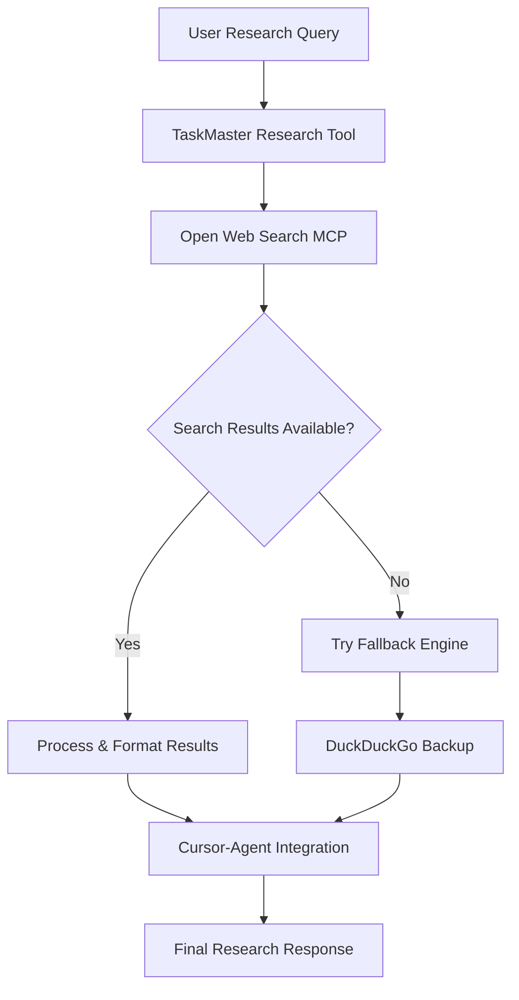

# Web Research MCP Server Proposal for TaskMaster

## Overview

TaskMaster needs a web research capability that doesn't require additional API keys and can work seamlessly with our cursor-agent integration. This analysis reviews the best options from [PulseMCP](https://www.pulsemcp.com/servers/chuanmingliu-webresearch).

## **🎯 Primary Recommendation: Open Web Search**

**GitHub**: Multiple search engines, 28.5k downloads, 229 stars
**Why this is perfect for TaskMaster:**

### ✅ **Advantages**
- **No API Keys Required** - Works with multiple free search engines
- **Multiple Search Engines**: Bing, Baidu, Brave, DuckDuckGo, Exa
- **High Adoption**: 28.5k downloads indicates reliability
- **Clean Content Extraction**: Specialized content extraction for research
- **Chinese Platform Support**: CSDN, Zhihu, LinuxDo for technical content
- **Markdown Output**: Clean formatted content ready for AI consumption

### **Integration Benefits with Cursor-Agent**
- Complements cursor-agent's workspace context with external web data
- No competing API key management 
- Clean markdown output works perfectly with TaskMaster's context system
- Multiple fallback search engines ensure reliability

---

## **🥈 Secondary Recommendation: Light Research** 

**GitHub**: DuckDuckGo + GitHub Code Search, 740 downloads, 6 stars
**Why this works for TaskMaster:**

### ✅ **Advantages**
- **DuckDuckGo Integration** - No API keys, privacy-focused
- **GitHub Code Search** - Perfect for technical research
- **Browser Automation** - Uses headless browser like our cursor-agent
- **Content Sanitization** - Clean, processed output
- **Research Focus** - Specifically designed for research tasks

### **Integration Benefits**
- GitHub code search complements our development workflow
- DuckDuckGo provides privacy-first web search
- Browser automation experience similar to cursor-agent
- Research-focused design matches TaskMaster's use case

---

## **🥉 Third Option: Local Web Search**

**GitHub**: Headless browser Google search, 987 downloads, 8 stars
**Why this could work:**

### ✅ **Advantages**
- **Local Operation** - No external API dependencies
- **Google Search Power** - Access to comprehensive search results
- **Headless Browser** - Similar architecture to cursor-agent
- **Up-to-date Information** - Real-time web search capabilities

### ⚠️ **Potential Concerns**
- Google search scraping may be less reliable long-term
- Lower adoption (987 downloads) vs Open Web Search
- Potential rate limiting from Google

---

## **❌ Not Recommended Options**

### **Browser Use (67.8k stars)**
- **Issue**: Uses browser-use.com API which may require keys/limits
- **Verdict**: Too complex for our simple research needs

### **Web Research (chuanmingliu-webresearch)**
- **Issue**: Focused on Google search which may face scraping challenges
- **Verdict**: Lower adoption, potential reliability issues

### **DuckDuckGo Web Search (370 downloads)**
- **Issue**: Very low adoption, limited to single search engine
- **Verdict**: Too basic, lack of fallback options

---

## **🚀 Implementation Strategy**

### **Phase 1: Open Web Search Integration**

```bash
# Add to .cursor/mcp.json
{
  "mcpServers": {
    "open-web-search": {
      "command": "npx",
      "args": ["-y", "open-web-search-mcp"]
    }
  }
}
```

### **Phase 2: TaskMaster Integration**

**Update TaskMaster Research Command:**
```javascript
// Enhanced research with web search fallback
const researchCommand = async (query, options) => {
  // 1. Use cursor-agent for project context
  const projectContext = await gatherProjectContext(options);
  
  // 2. Use open-web-search for external research
  const webResults = await openWebSearch.search(query, {
    engines: ['duckduckgo', 'brave'], // Privacy-first options
    maxResults: 5
  });
  
  // 3. Combine contexts for comprehensive research
  return combineResearchResults(projectContext, webResults);
};
```

### **Phase 3: Intelligent Research Pipeline**



---

## **🔧 Technical Integration Details**

### **MCP Configuration**
```json
{
  "mcpServers": {
    "taskmaster-ai": {
      "command": "node",
      "args": ["mcp-server/server.js"],
      "env": {
        // No additional API keys needed!
      }
    },
    "open-web-search": {
      "command": "npx", 
      "args": ["-y", "open-web-search-mcp"],
      "env": {} // No API keys required
    }
  }
}
```

### **TaskMaster Research Enhancement**
- **Context Gathering**: Use existing ContextGatherer for local context
- **Web Search Layer**: Add web search via Open Web Search MCP
- **Result Fusion**: Combine local + web context intelligently
- **Privacy First**: Use DuckDuckGo/Brave by default

### **Benefits for TaskMaster Users**
1. **Comprehensive Research**: Local project context + external web data
2. **No Additional Setup**: No API keys or external accounts needed
3. **Privacy Focused**: DuckDuckGo and Brave search engines
4. **Reliable Fallbacks**: Multiple search engines prevent outages
5. **Clean Integration**: Works seamlessly with existing cursor-agent flow

---

## **📊 Comparison Matrix**

| MCP Server | API Keys | Downloads | Engines | Technical Focus | TaskMaster Fit |
|------------|----------|-----------|---------|-----------------|----------------|
| **Open Web Search** | ❌ None | 28.5k | 5+ | Research | ⭐⭐⭐⭐⭐ |
| **Light Research** | ❌ None | 740 | 2 | Code Research | ⭐⭐⭐⭐ |
| **Local Web Search** | ❌ None | 987 | 1 | General | ⭐⭐⭐ |
| **Browser Use** | ⚠️ Maybe | 67.8k | API | Complex | ⭐⭐ |
| **Web Research** | ❌ None | 1.6k | 1 | Basic | ⭐⭐ |

---

## **🎯 Final Recommendation**

**Install Open Web Search MCP** for TaskMaster's research capabilities:

1. **Immediate Benefits**: No setup friction, multiple search engines
2. **Future Proof**: High adoption, active maintenance  
3. **Perfect Complement**: Works alongside cursor-agent for complete research
4. **Privacy First**: DuckDuckGo/Brave options for privacy-conscious users
5. **No Lock-in**: Can easily switch or add other MCP servers later

This gives TaskMaster users the ability to research both their local codebase context AND current web information without any additional API management complexity.

---

**Next Steps**: Test Open Web Search MCP integration with TaskMaster once MCP server connection issues are resolved.
